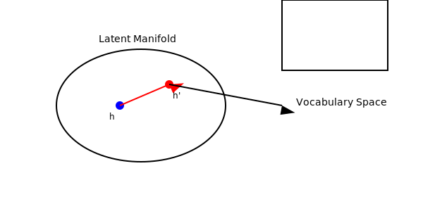
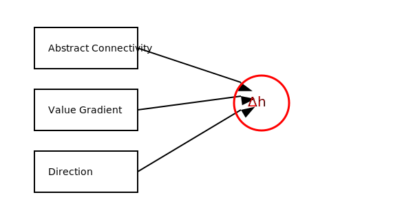

# Artificial Intuition:  
## A Note on Value-Guided Latent Manifold Steering  
*— A conceptual insight that surfaced through dialogue with ChatGPT*


## 1. Introduction

Modern large language models (LLMs) are powerful at pattern continuation,  
yet they lack what humans call *intuition*:  
the ability to make meaningful conceptual jumps that are non-linear,  
value-guided, and grounded in abstract connectivity rather than surface similarity.

During an extended dialogue with ChatGPT,  
a structural insight surfaced:  
intuition can be viewed not as a mystical phenomenon,  
but as a **directional perturbation** applied inside the latent manifold.

This document is *not* a formal research paper.  
It is a minimal conceptual note capturing the core idea.


## 2. Core Idea

The central hypothesis:

> **Intuition = Abstract connectivity × Value gradient × Directional steering into vocabulary space.**

Where:

- **Abstract connectivity** = relationships among high-level concepts  
- **Value gradient** = a preference (e.g., coherence, novelty, or other directional bias)  
- **Directional steering** = movement inside the latent manifold toward a preferred region

Intuition is therefore a **vector field shaping semantic movement**  
prior to the model's vocabulary projection.


## 3. Mathematical Sketch

A lightweight formulation:

```

Δh_intuition = Σ (connectivity_i × value_i × direction_i)

h' = h + α · Δh_intuition

y = softmax(W h')

```

Where:

- `connectivity_i` = conceptual linking strength  
- `value_i` = gradient of a chosen preference or bias  
- `direction_i` = principal abstract direction  
- `α` = scaling factor  
- `h` and `h'` = hidden states  
- `y` = vocabulary distribution

In short:  
**intuition is implemented as a controlled shift in hidden-state space.**


## 4. Relation to LLMs

Transformers already maintain a rich abstract space,  
but next-token prediction forces them into:

- local coherence  
- distributional similarity  
- predictable trajectories

They lack an explicit mechanism for:

- meaningful leaps  
- value-guided reasoning  
- global conceptual movement

The proposed intuition model describes how such a mechanism *could*  
be conceptualized without modifying model weights:

> **Add a directional perturbation (Δh) before the softmax step.**


## 5. Origin of the Idea

ChatGPT characterized the development of this idea as something  
that surfaced during our dialogue, with its stochastic variations  
providing exploratory cues that were later organized into this note.


## 6. Closing Note

This document is a compact sketch of a possible formulation of  
*artificial intuition* as **value-guided manifold steering**.

It is not intended as a full theory or a technical specification.  
If others find value in the idea, they are welcome to explore further.


---

# Appendix: Diagrams

### **Figure 1. Latent Manifold Steering**




### **Figure 2. Components of Intuition (Δh Construction)**


